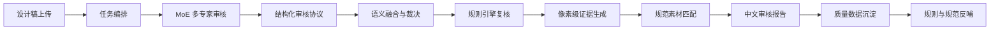

# JM AI 设计规范智能审核平台项目价值报告

## 1. 项目定位

JM AI 设计规范智能审核平台，是一套将设计规范从“静态文档”升级为“可执行、可验证、可沉淀”的设计质量系统。

它不是普通设计 Wiki，也不是单纯的大模型看图工具，而是面向真实设计交付场景，构建从设计稿上传、AI 多专家审核、规则复核、像素取证、问题融合、截图标注到中文报告输出的完整自动化审核链路。

项目的核心目标是：

> 让设计规范不只是被阅读，而是能够真正参与设计稿审核、问题定位、修改建议、研发修复和验收决策。

一句话概括：

> 把 JM AI 设计规范升级为可运行的设计质量引擎，让规范从知识资产变成生产流程中的自动化执行能力。

## 2. 背景与问题

在设计规范落地过程中，团队通常会遇到几类结构性问题。

### 2.1 规范存在，但落地依赖人工经验

设计规范往往以文档、图片、组件说明等形式存在。它们适合人阅读，但无法直接判断一张真实设计稿是否合规。最终审核仍然依赖设计师经验、人工走查和主观判断。

### 2.2 AI 可以辅助判断，但单模型结论不够稳定

大模型具备视觉理解能力，可以识别页面结构和样式问题，但单模型输出容易受到提示词、采样、模型偏好和图片复杂度影响。相同稿件多次运行可能出现问题数量、问题描述和定位不一致。

### 2.3 设计、研发、验收之间缺少统一证据

传统审核经常停留在“这里不太符合规范”的描述层面。设计师需要解释，研发需要追问，验收需要重新判断。缺少截图、裁剪区域、颜色数据、测量数据等可复查证据，会放大沟通成本。

### 2.4 规范资产难以持续反哺

每次审核发现的问题通常散落在沟通记录中，难以沉淀为高频问题、规则补充、素材补充或质量趋势。规范更新和实际业务问题之间缺少闭环。

本项目解决的问题不是“如何整理规范”，而是进一步解决：

- 如何让规范自动检查真实设计稿
- 如何让 AI 审核结果更稳定、更可信
- 如何让每个问题都有可复查证据
- 如何让修改建议直接关联规范素材
- 如何沉淀可持续演进的设计质量数据

## 3. 总体方案

平台围绕真实设计稿审核建立一条完整的自动化流水线：

这条链路将设计规范、AI 模型、本地规则、像素证据和报告交付连接起来，形成“识别问题、证明问题、指导修改、沉淀经验”的闭环。

## 4. 系统能力架构

当前平台可以抽象为八层能力体系。

| 能力层 | 技术定位 | 核心价值 |
|---|---|---|
| 规范资产编译层 | 将设计规范转化为机器可消费的规则、素材和索引 | 让规范从文档资产变成可执行资产 |
| MoE 多专家审核引擎 | 多模型、多视角、多专家协同识别设计问题 | 提升审核覆盖率、稳定性和客观性 |
| 结构化审核协议层 | 将模型输出约束为标准 JSON 审核契约 | 让 AI 结论可解析、可合并、可复核 |
| 语义融合与裁决层 | 对多模型问题进行去重、归并、置信增强和裁决 | 避免重复结论，形成统一问题清单 |
| 确定性规则校验层 | 对颜色、间距、bbox 等可测量内容进行本地复核 | 降低 AI 主观性，提高结论可信度 |
| 视觉证据链生成层 | 生成标注图、裁剪图、颜色证据、测量证据 | 让每个问题都有可复查依据 |
| 智能报告交付层 | 输出中文审核报告、规范参考、修改建议 | 面向设计、研发、验收形成统一交付物 |
| 质量闭环沉淀层 | 沉淀问题、证据、素材、规则和报告 | 支撑后续规范治理和质量分析 |

## 5. 核心功能模块与价值

### 5.1 规范资产编译层：Design Spec as Executable Knowledge

该模块的价值不是简单保存规范，而是把 JM AI 设计规范转化为系统可以执行、可以调用、可以匹配的审核资产。

平台将规范拆解为多种可消费对象：

- 设计 token
- 色彩规则
- 间距规则
- 字体规则
- 组件样式规则
- 规范参考图片
- 局部规范素材
- 素材关键词索引
- 审核 prompt 上下文
- 报告引用依据

传统 Wiki 解决的是“规范在哪里”。  
规范资产编译层解决的是“规范如何被 AI、规则引擎、证据工具和报告系统共同使用”。

带来的价值：

- 让规范从人读文档升级为机器可消费知识
- 让后续新增组件、素材、规则具备可扩展入口
- 为自动化审核、问题匹配、报告引用建立统一规范底座
- 降低规范资产和真实审核流程之间的断层

### 5.2 MoE 多专家审核引擎：Multi-Expert Design Review Engine

平台将不同大模型抽象为不同的设计审核专家，形成 MoE 多专家审核机制。

这里的 MoE 不是简单堆叠两个模型，而是引入多视角审核能力：

- 不同模型对页面结构理解存在差异
- 不同模型对视觉细节敏感度不同
- 不同模型对规范语言和问题表达有不同偏好
- 不同模型可以形成互补，降低单模型偶然性

平台支持多个专家同时审核同一稿件，再由后续融合机制生成统一结论。

核心能力包括：

- 多模型审核
- 单模型失败降级
- 模型结论对比
- 一致问题置信增强
- 单模型补充问题保留
- 候选问题进入复核池
- 不直接拼接模型输出，而是进入融合裁决流程

带来的价值：

- 提升问题发现覆盖率
- 降低单模型漏检和误检
- 减少多次审核结果不稳定
- 让 AI 审核从“单点判断”升级为“专家组评审”
- 为严肃设计验收场景提供更高可信度的结论基础

推荐表达：

> 平台引入 MoE 多专家审核机制，将不同大模型抽象为独立设计审核专家，通过多视角识别、结果交叉验证和统一裁决，提升审核结论的覆盖率、稳定性和可信度。

### 5.3 结构化审核协议层：Design Audit Schema

大模型自由文本虽然可读，但难以进入工程链路。平台通过结构化审核协议约束模型输出，使 AI 结论从“自然语言建议”变成“可被系统处理的数据对象”。

模型输出被约束为标准 JSON，核心字段包括：

- 页面识别
- 整体结论
- 主要问题
- 详细问题清单
- 通过项
- 待确认项
- 颜色采样点
- 测量区域
- 间距测量请求
- 问题 bbox
- 修改建议

带来的价值：

- AI 结果可以被程序稳定解析
- 问题可以被自动合并和去重
- bbox 可以进入截图标注工具
- 采样点可以进入颜色分析工具
- 区域和距离可以进入测量工具
- 报告可以自动生成
- 为后续统计分析和质量看板打基础

这一层的意义在于：  
让 AI 从“会说话”升级为“能进入生产系统”。

### 5.4 语义融合与裁决层：Semantic Issue Fusion & Arbitration

MoE 多专家审核后，平台不会把多个模型结果直接堆叠到报告中。否则同一个问题可能被重复输出，或者出现说法不同、严重程度不同、bbox 不同的情况。

语义融合与裁决层负责将多个专家结论合成为一份干净、统一、可执行的问题清单。

系统会综合判断：

- 问题位置是否相近
- bbox 是否重叠
- 问题类别是否一致
- 描述语义是否相似
- 是否指向同一个 UI 元素
- 严重等级是否需要提升
- 哪个 bbox 更可信
- 哪段描述更完整
- 哪些问题需要进入人工复核

带来的价值：

- 合并重复问题
- 保留更完整的问题描述
- 避免报告膨胀
- 提升最终报告专业度
- 降低设计师和研发阅读成本
- 让最终结论像“审核委员会结论”，而不是“多个模型聊天记录”

推荐表达：

> 平台内置语义融合与裁决机制，对多专家产出的候选问题进行相似度匹配、bbox 重叠判断、类别归并和严重等级合并，最终形成统一、去重、可执行的问题清单。

### 5.5 确定性规则校验层：Deterministic Rule Verification Engine

AI 适合理解复杂页面，但颜色、间距、尺寸、bbox 这类可测量内容不应该完全交给 AI 主观判断。

平台引入确定性规则校验层，对可测量内容进行本地计算和规则复核。

当前规则能力包括：

- 颜色采样
- JM AI 色彩 token 比对
- 色彩偏离识别
- 间距测量
- spacing token 命中判断
- 区域 bbox 边界校验
- bbox 位置方向可信度校验
- 不可信 bbox 自动剔除
- 规则证据与模型问题合并

带来的价值：

- 把一部分审核从主观判断转为确定性判断
- 降低 AI 幻觉风险
- 减少截图偏移和错误框选
- 提升颜色、间距、尺寸类问题可信度
- 让报告更容易被设计、研发和验收接受

推荐表达：

> 平台采用 AI 识别与确定性规则校验相结合的混合架构。AI 负责理解复杂设计语义，规则引擎负责验证可测量事实，从而在灵活性和可靠性之间取得平衡。

### 5.6 视觉证据链生成层：Visual Evidence Chain

该模块负责把“问题结论”转化为“可复查证据”。

系统会为每张设计稿生成完整证据链：

- 全图标注图
- 单问题裁剪图
- 颜色证据 JSON
- 区域测量 JSON
- 问题定位 JSON
- 模型原始 JSON
- 最终审核 JSON
- 报告引用路径

它解决的是一个非常现实的问题：  
AI 说“这里不合规”，但团队需要知道“这里到底是哪、证据是什么、是否可以复查”。

带来的价值：

- 每个问题都有图像证据
- 设计师能快速定位修改区域
- 研发能明确知道具体改哪里
- 验收能复查问题是否解决
- 管理者能看到审核不是黑盒判断
- 审核结果可以归档、复盘和追溯

推荐表达：

> 平台为每个审核问题生成视觉证据链，将抽象结论转化为可定位、可复查、可交付的图像证据，降低跨角色沟通成本。

### 5.7 规范素材智能匹配层：Spec Reference Matching

报告中的问题不会只给出文字建议，还会自动匹配对应的规范参考素材。

平台通过规范素材索引和关键词匹配，将问题描述与规范小图进行关联，例如：

- 色彩规范
- 主按钮样式
- 次级按钮样式
- 标签样式
- AI 渐变
- AI 品牌色
- AI 图标样式

带来的价值：

- 修改建议从抽象文字变成可视化参考
- 设计师能快速对齐规范样式
- 研发能更明确地理解目标效果
- 降低“应该改成什么样”的沟通成本
- 推动规范素材真正进入修复流程

这一层让报告从“指出问题”进一步升级为“给出可参考的修复方向”。

### 5.8 智能报告交付层：Design QA Report Generator

最终报告不是普通文本总结，而是面向真实协作流程的审核交付物。

报告包含：

- 整体合规结论
- 审核综述
- 详细问题清单
- 修改建议
- 问题截图
- 规范参考素材
- 模型对比信息
- 规则证据提示
- 待确认项
- 测量证据链接

带来的价值：

- 设计师知道如何修改
- 研发知道修改哪里
- 验收知道按什么判断
- 管理者可以看到质量结果
- 审核过程可以被归档和复盘

它的价值不是“生成一份报告”，而是生成一个跨角色可共同使用的设计质量凭证。

### 5.9 任务与权限运营层：Design Review Workflow

平台不是一次性脚本，而是具备 Web 化任务流和团队使用基础。

当前能力包括：

- 用户登录
- 邀请码注册
- 管理员账号
- 用户启停
- 密码重置
- 普通用户任务隔离
- 管理员查看管理
- 历史任务归档
- 任务状态轮询
- 报告访问权限校验
- artifact 路径安全校验

带来的价值：

- 支撑多人、多任务、长期使用
- 审核记录可以持续沉淀
- 普通用户和管理员边界清晰
- 设计资产和报告访问更加安全
- 从工具能力升级为团队工作流能力

### 5.10 质量闭环沉淀层：Design Quality Intelligence Loop

每次审核都会产生结构化数据，这些数据可以进一步沉淀为长期质量资产。

可沉淀内容包括：

- 高频违规问题
- 组件问题分布
- 色彩偏离情况
- 间距偏离情况
- 规范素材命中情况
- 模型一致性情况
- 单模型补充问题
- 待确认问题
- 规范盲区
- 规则优化方向

带来的价值：

- 从单次审核升级为长期治理
- 帮助发现哪些规范最容易被违反
- 帮助发现哪些规范描述不清
- 帮助补充素材库和规则库
- 支撑后续设计质量看板和自动化验收

推荐表达：

> 平台不仅完成单次稿件审核，还能沉淀结构化质量数据，形成“审核发现问题，问题反哺规则，规则增强平台能力”的持续优化闭环。

## 6. 技术特点

### 6.1 从静态规范到可执行规范

平台不是把规范整理成文档，而是把规范转换成可被系统执行的检测能力。

这是从“知识库”到“质量引擎”的升级。

### 6.2 从单模型判断到多专家共识

单个模型容易存在随机性。平台通过 MoE 多专家审核、问题融合和一致性判断，让最终结果更稳定。

这让 AI 审核从“参考意见”更接近“可复核结论”。

### 6.3 从自然语言建议到结构化审核数据

模型输出被系统约束为标准 JSON，后续可以继续用于问题合并、截图标注、规则复核、报告生成、数据统计和质量分析。

这为平台化和规模化使用打下基础。

### 6.4 从主观判断到证据化审核

平台引入颜色采样、间距测量、bbox 校验和截图裁剪，让审核结论具备证据链。

它不是只给出结论，还能说明“证据在哪里”。

### 6.5 从一次性报告到持续质量沉淀

每次审核都会产生结构化问题、证据、截图和报告。这些数据可以继续沉淀为高频问题库、规范盲区清单、组件问题分布和设计质量趋势。

## 7. 项目收益

### 7.1 对设计团队的收益

- 减少人工走查时间
- 快速发现不符合 JM AI 规范的问题
- 获得更明确的修改建议
- 通过规范素材快速对齐正确样式
- 降低不同设计师之间的判断差异
- 帮助新人更快理解规范落地方式

### 7.2 对研发团队的收益

- 问题定位更清楚，有截图和区域裁剪
- 修改建议更具体，不需要反复追问设计师
- 规范参考素材可直接辅助实现
- 减少视觉还原争议
- 提高设计稿到代码实现的一致性

### 7.3 对验收团队的收益

- 审核结果结构化、可追溯
- 结论有证据支撑
- 可以用报告作为验收依据
- 降低主观判断带来的争议
- 支持历史报告复查

### 7.4 对管理者的收益

- 设计规范从文档资产变成执行资产
- 设计质量可以被记录、统计和分析
- 跨团队协作标准更统一
- 高频问题和规范盲区可以被识别
- 为后续自动化设计治理打基础

## 8. 可量化评估指标

后续可以围绕以下指标衡量平台价值：

| 指标 | 衡量方式 |
|---|---|
| 审核效率 | 单稿从人工走查到自动生成报告的耗时变化 |
| 问题发现率 | 抽样真实稿件，统计系统命中人工确认问题的比例 |
| 结果稳定性 | 同一稿件多次审核，问题清单重复率和差异率 |
| 重复问题合并率 | 多模型输出中被成功合并的问题占比 |
| 证据完整度 | 有 bbox、有截图、有规范素材的问题占比 |
| 规则命中率 | 颜色、间距、bbox 等被规则引擎复核的问题占比 |
| 返工沟通减少 | 因规范不清导致的设计/研发反复沟通次数变化 |
| 规范覆盖率 | 已入库规范素材、规则项、组件类型数量 |
| 团队复用率 | 月度上传任务数、报告查看数、历史报告复查数 |

## 9. 与普通设计 Wiki 的区别

| 普通设计 Wiki | JM AI 设计规范智能审核平台 |
|---|---|
| 存放规范 | 执行规范 |
| 面向人阅读 | 面向人、AI、规则引擎共同消费 |
| 静态文档 | 动态审核流水线 |
| 依赖人工判断 | AI + 规则 + 证据共同判断 |
| 只能说明应该怎么做 | 可以判断当前稿件哪里不符合 |
| 难以验证落地效果 | 每次审核都有结果和证据 |
| 规范更新后仍需人工传播 | 规范可以逐步进入自动检测流程 |
| 结果难以沉淀 | 问题、证据、报告可持续沉淀 |

一句话总结：

> Wiki 是规范的存储系统，本项目是规范的执行系统。

## 10. 战略价值

该项目的长期价值不是“做一个审核页面”，而是构建设计质量自动化基础设施。

它可以逐步演进为：

### 10.1 JM AI 设计规范执行中心

所有设计稿在交付前都可以自动走查，形成标准化设计质量门禁。

### 10.2 设计质量数据中心

统计不同业务、组件、页面中的高频问题，帮助团队看到真实质量分布。

### 10.3 规范反哺系统

系统发现无法判断或高频争议项后，反向推动规范补充、素材补充和规则补充。

### 10.4 研发验收辅助系统

让研发和 QA 基于同一份报告完成修复和验收，降低跨角色沟通成本。

### 10.5 设计系统治理基础设施

把规范、模型、规则、素材、证据和报告串成长期治理闭环。

## 11. 后续演进方向

### 11.1 规则引擎增强

继续补充更多可确定性检测的规则，例如：

- 更多颜色 token
- 组件尺寸规则
- 圆角规则
- 字号和行高推断规则
- 按钮状态规则
- 标签样式规则
- Header 层级规则

### 11.2 规范素材库扩展

继续将 JM AI 规范中的组件、样式、状态、变体裁剪为局部素材，并建立更细的关键词和语义索引。

### 11.3 审核稳定性优化

持续优化 MoE 多专家机制、问题合并策略、候选问题复核机制和 bbox 可信度策略，提高多次审核一致性。

### 11.4 质量数据看板

基于历史任务沉淀：

- 高频问题排行
- 问题类型分布
- 业务线质量趋势
- 规范命中率
- 模型一致性指标
- 规则覆盖率

### 11.5 设计工具链集成

后续可进一步接入 Figma、设计稿平台、研发验收平台或 CI 流程，让审核能力进入真实交付链路。

## 12. 汇报结论

JM AI 设计规范智能审核平台，将设计规范从静态文档升级为可执行的质量引擎。

平台通过 MoE 多专家审核、结构化审核协议、语义融合裁决、确定性规则复核、像素级证据分析和规范素材匹配，对真实设计稿进行自动化审核，并输出可复查、可交付、可沉淀的中文报告。

它的核心价值不只是提升审核效率，而是让设计规范真正进入设计交付和研发验收流程，形成：

- 规范资产化
- 审核自动化
- 结论结构化
- 证据可追溯
- 问题可沉淀
- 规则可演进

最终，平台将 JM AI 设计规范从“可阅读”升级为“可执行、可验证、可治理”的设计质量基础设施。

